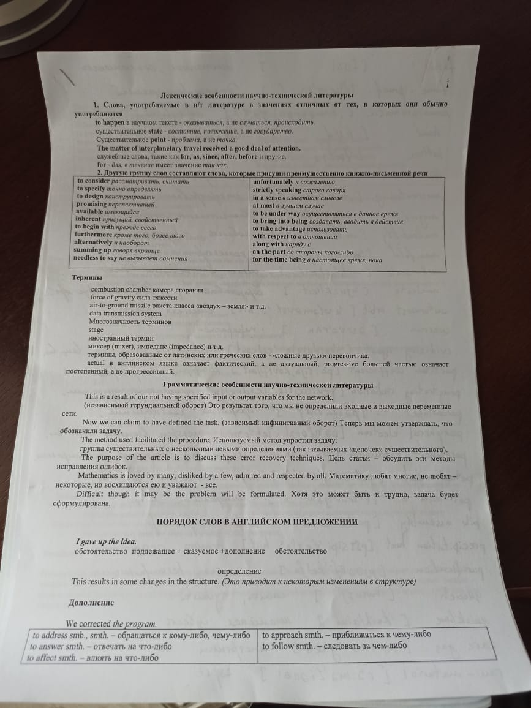
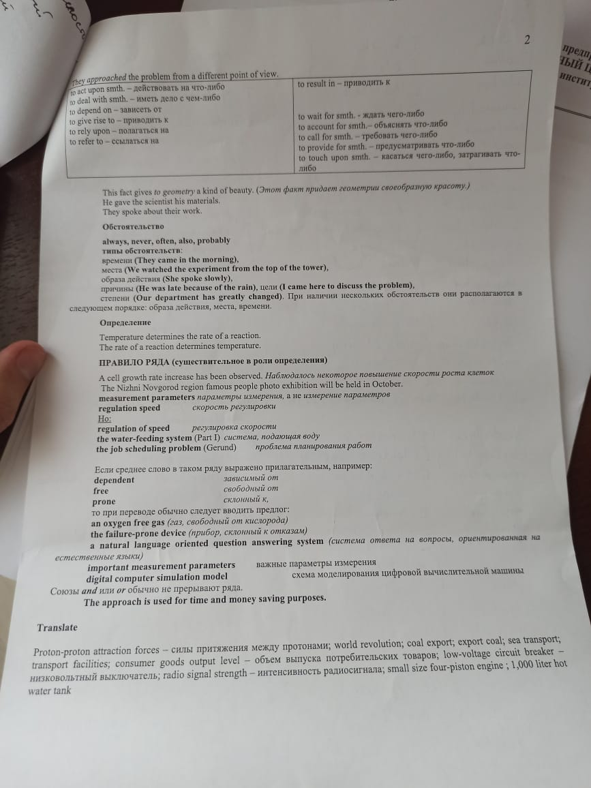
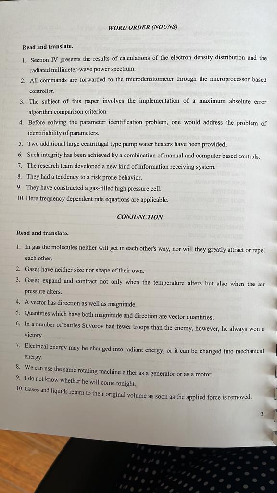

# Лекция 1

На предпоследнем занятии будет сдача задания по словарю.
Первый вариант словаря нужно сдать пораньше

В словарь выписывать только в начальной форме

**Термин** - слово или словосочетание, приятое для обозначения специальных понятий в той или иной области науки и техники

Перевод терминов осуществляется с последнего слова

| Термин                  | Определение                    |
| ----------------------- | ------------------------------ |
| Combustion chamber      | Камера сгорания                |
| Force of gravity        | Сила тяжести                   |
| Air-to-ground missle    | Ракета земля-воздух            |
| Data transmition system | Система передачи данных        |
| Stage                   | Этап, ступень, фаза            |
| Actual                  | Фактический (Не актуальный)    |
| Progressive             | Постепенный (Не прогрессивный) |

Обращаться к словарям нужно часто, так как есть *ложные друзья переводчика* по типу *actual, progressive*

## Грамматическая особенность научной литературы

Научной литературе характерны длинные и сложные предложения. 
Переводить их стоит сложноподчиненными предложениями. 
Если видим два слова в одной форме, то ближнее к существительному - причастее, дальнее - глагол.
Инверсия используется для придачи эмоционального значения конструкции.

## Порядок слов в английском предложении

***I gave up the idea***

(Обстоятельство) Подлежащее + сказуемое + дополнение (обстоятельство)

Для связи слов в английском языке используются служебные слова.

//TODO виды обстоятельств

Дополнение может быть прямым и косвенным.
Дополнение всегда находится после сказуемого. Мб с предлогом, мб и без.

Обстоятельство иногда может находиться и в середине предложения.
Такое может происходить, когда обстоятельство находится между подлежащим и сказуемым. В основном они относятся к Present Simple.
Например: 
    *Always, never, often, also, probably.*

## Правило ряда

*Если после артикля или другого определителя существительного стоит ряд слов, чаще всего существительных, в единственном числе и без предлога, предлоги обычно прерывают ряд, то только последнее из них будет тем словом, к которому отнсится артикль.И с которого нужно начинать перевод данного ряда, ставя вопрос "Какой", "Что" и т.д. Все остальные слова являются его определениями*

Определение находится вне системы, потому что может определять любой член преложения
