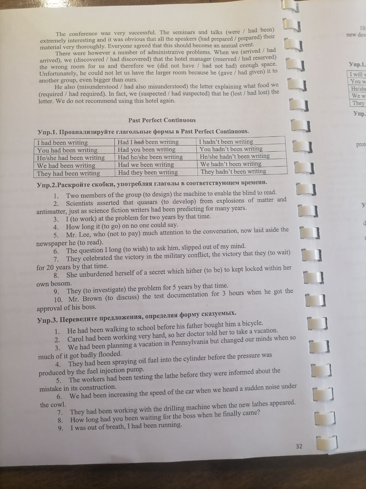
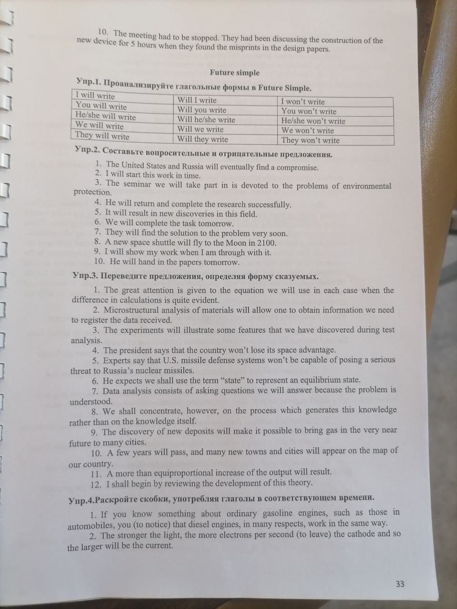
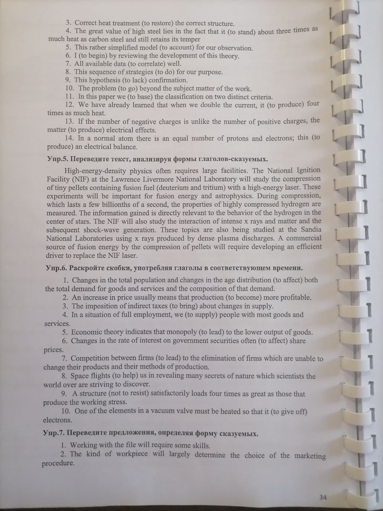
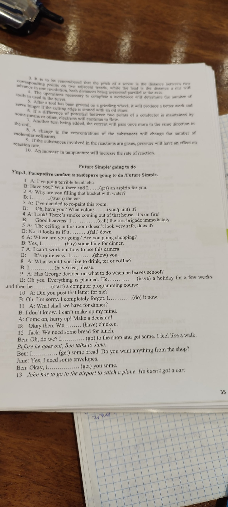

# Лекция 5

## Организационные моменты

Нужно заполнять электронное портфолио нужно заполнять ко времени аттестации. 
Электронное и бумажное портфолио должны совпадать.

Найти своё портфолио можно на портале -> Информационные панели -> Доступные сайты -> Аспирантура

В электронное дело входит:
* Приказы по обучению. Непосредственно по обучению
* Допуски к экзаменам (Английский, Философия и т.д.)
* Отчёты
* Практики
* Индивидуальные планы

Сейчас нужно в папке своего портфолио создать подпапки:
* Первый курс
* * Приказы
* * * Приказ об обучении (файл)
* * * Приказ о сдаче кандидатского экзамена (файл)
* * * ...
* * Английский язык и всё, что с ним связано 
* * Философия (Как скажет преподаватель)
* Документы 
* * Снилс
* * Диплом
* * Паспорт
* 
  
Лучше все допуски и материалы сканировать. 
Если что-то сканировать, то лучше сканировать одним файлом.

На портале найти электронное портфолио. 

## Лекция

### Past perfect continuous 

Употребляется в речи довольно редко. В основном при косвенной речи. 
Формируется также, как и present perfect continuous, только have->had

* (?) -> had ставится в начале предложения
* (-) -> отрицается had

### 32-3
### 32-2

## Future simple

### 33-2
### 33-3

### 34-5
### 34-6

#### Present continuous

Употребляется в плане "Собираюсь"

    We are going to Italy next month (Мы собираемся...)
    Are we going to Italy next month
    We are not going to Italy next month

#### Future simple

Употребляется в момент разговора

    John and Mary are talking now
    John will go to Italy next month
    Jogh says: "I will go..."

### 35-1

